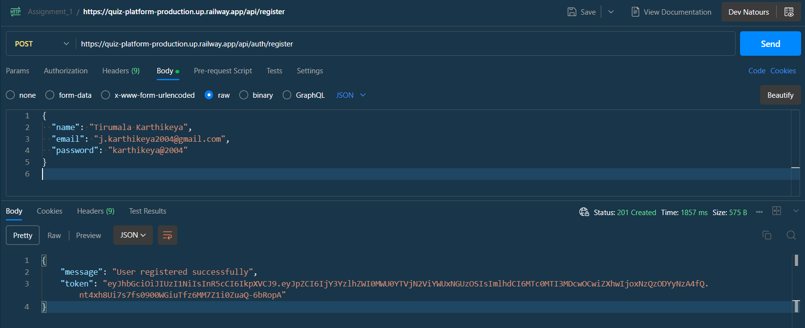
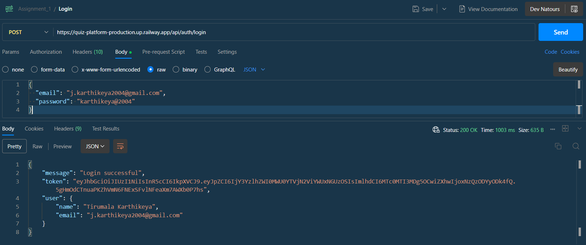
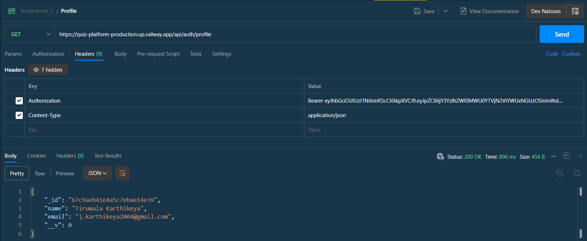
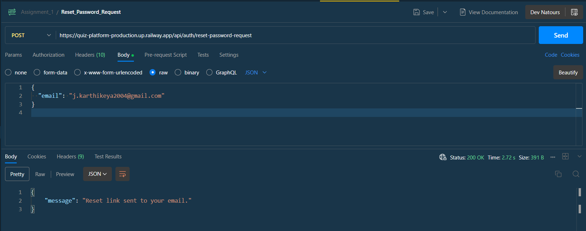
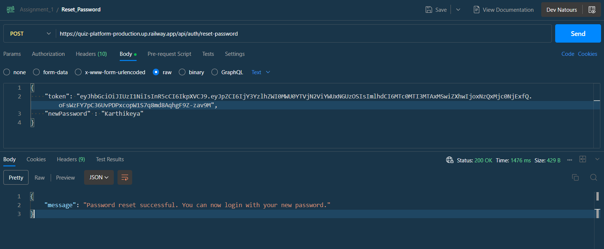
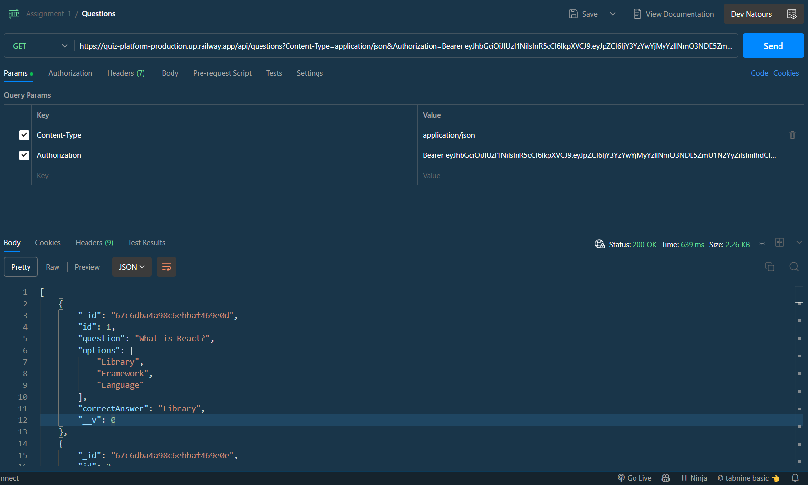

# Assignment\_1

## Project Overview

This is a Node.js and Express-based authentication system with JWT-based password reset functionality using MongoDB.

## Features

- User Registration & Login
- Password Reset with JWT Tokens
- MongoDB Database Connection

## Technologies Used

- Node.js
- Express.js
- MongoDB (Mongoose)
- JWT (JSON Web Tokens)
- Bcrypt for password hashing
- dotenv for environment variables

## Installation

1. Clone the repository:

   ```sh
   git clone https://github.com/tirumala-karthikeya/Assignment_1.git
   cd Assignment_1
   ```

2. Install dependencies:

   ```sh
   npm install
   ```

3. Create a `.env` file and add the following environment variables:

   ```env
   MONGO_URI=your_mongodb_connection_string
   JWT_SECRET=your_secret_key
   PORT=5000
   ```

4. Start the server:

   ```sh
   npm start
   ```

   or for development mode (auto-restart on changes):

   ```sh
   npm run dev
   ```

## API Endpoints

### User Authentication

#### Register User

**POST** `/api/auth/register`

```json
{
  "name": "John Doe",
  "email": "johndoe@example.com",
  "password": "securepassword"
}
```


#### Login User

**POST** `/api/auth/login`

```json
{
  "email": "johndoe@example.com",
  "password": "securepassword"
}
```


### Profile Page



### Password Reset

#### Request Password Reset

**POST** `/api/auth/reset-password-request`

```json
{
  "email": "j.karthikeya2004@example.com"
}
```


#### Reset Password

**POST** `/api/auth/reset-password`

```json
{
  "token": "jwt_token_received_in_email",
  "newPassword": "newsecurepassword"
}
```


### Email


### Questions



